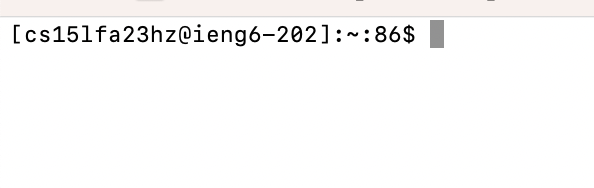
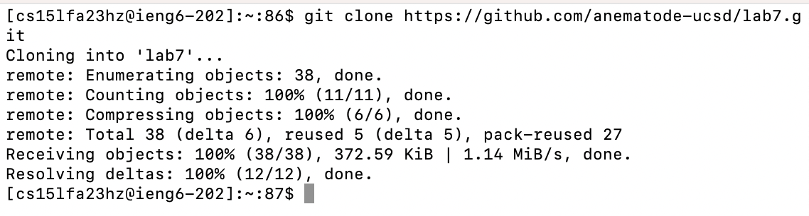
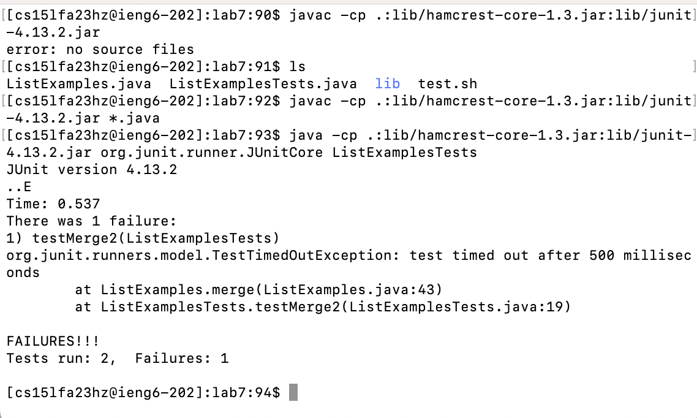
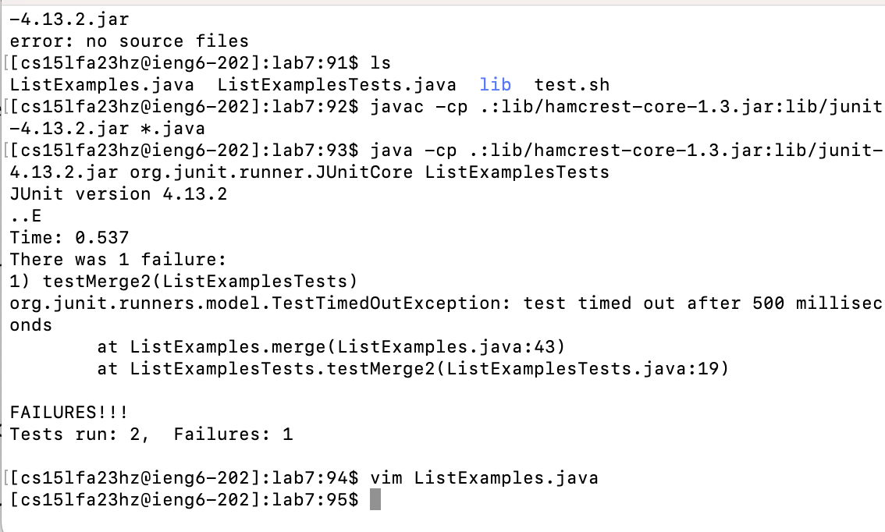
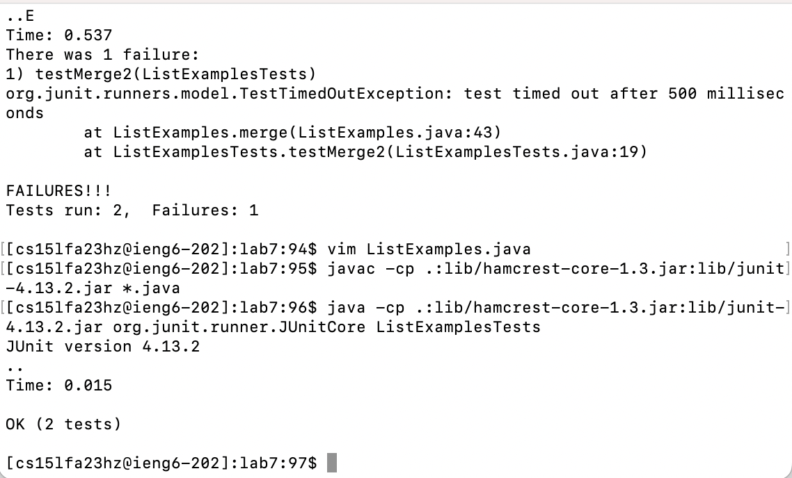
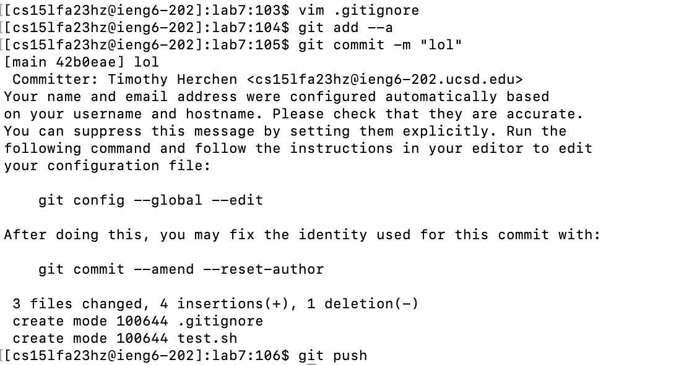

# Lab report 4

## Step 4

Keys pressed: `ssh cs15lfa23..@ieng6.ucsd.edu<enter>`



## Step 5

Keys pressed: `git clone https://github.com/anematode-ucsd/lab7.git<enter>`



## Step 6

`cd lab7<enter>javac -cp .:lib/hamcrest-core-1.3.jar:lib/junit-4.13.2.jar *.java<enter>java -cp .:lib/hamcrest-core-1.3.jar:lib/junit-4.13.2.jar org.junit.runner.JUnitCore ListExamplesTests`

This took me into the cloned repository directory, then complied the java files and then ran them.



## Step 7

`vim ListExamples.java<enter>Gkkkkkkwceindex2<esc>:wq<enter>`

This took me to replace the last instance of "index1" in the file with "index2".



## Step 8

`<up<up><up><enter><up><up><up><enter>`

In this case, I ran the `javac` and `java` commands from above to compile and run the tests.



## Step 9

```
vim .gitignore<enter>
i*.class<esc>:wq<enter>
git add --a<enter>
git commit -m "lol"<enter>
git push<enter>
<my credentials><enter>
```

Here, I added .class files to the .gitignore file, then committed my changes and pushed.


