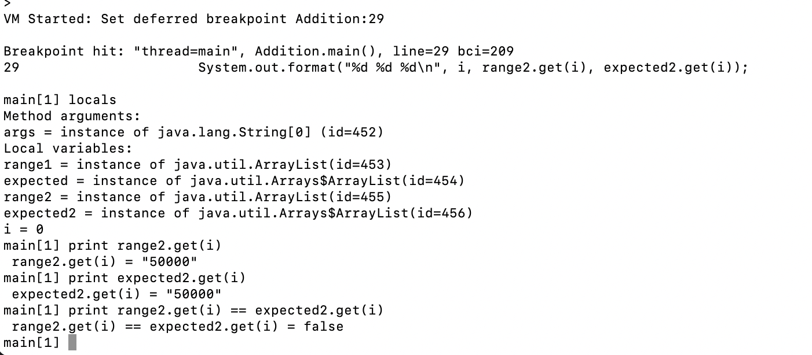
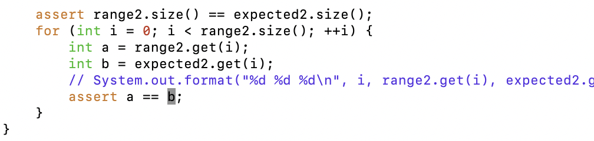

# Lab report 5 – final

### Original post

Student: Hi there, I'm having trouble with a helper function I'm trying to write to generate a range of numbers. I'm using assertions to test whether the helper function is working. For some reason, the assertions seem to be failing with some reasonable inputs.


I run this with my test command `bash test.sh`, which just runs

```
javac Addition.java
java -ea Addition
```

Note that the `-ea` enables the assertions. For some reason, I get an assertion failure when checking the second result:

```
Exception in thread "main" java.lang.AssertionError
	at Addition.main(Addition.java:29)
```

So I tried printing out the values in the second loop with the line

```
System.out.format("%d %d %d\n", i, range2.get(i), expected.get(i));
```

and I get the following results:


```
0 50000 50000
Exception in thread "main" java.lang.AssertionError
	at Addition.main(Addition.java:30)
```

So, it seems to be thinking that 50000 is not equal to 50000, which makes no sense. Why does it work the first time and then not the second time?

### TA response

Hey! Interesting usage of `assert` statements instead of JUnit!

You seem to be reusing the `expected` variable, which might be causing problems. Could you try initializing a new variable and see if that fixes the problem?

### Student response

I tried replacing `expected` with `expected2` for the second test. It still doesn't seem to work.

The updated snippet of code:

```
		ArrayList<Integer> range2 = Addition.range(50000, 50004);
		List<Integer> expected2 = Arrays.asList(new Integer[]{50000, 50001, 50002, 50003});

		assert range2.size() == expected2.size();
		for (int i = 0; i < range2.size(); ++i) {
			System.out.format("%d %d %d\n", i, range2.get(i), expected2.get(i));
			assert range2.get(i) == expected2.get(i);
		}
```

The error still seems to occur:


I emailed you a copy of the code.

### TA response

Thanks for the email. Interesting, so renaming the variable didn't seem to help? The code looks ok to me.

Could you try using jdb to see if you can diagnose the problem?

### Student response

I opened it in jdb and what I'm getting is very confusing. All the variables are as expected, and range2.get(i) and expected2.get(i) both are 50000. But when I ask it to compare them, it says they aren't equal.



Interestingly, if I assign the variables to some named variables, then the code works:



As you can see, the assertions no longer fail:


### TA response

I'm glad you were able to fix the problem! It may be an issue with using assert, which is not used very much, instead of JUnit. I suggest you rewrite your test cases to use JUnit instead.

### Files

test.sh:

```
javac Addition.java
java -ea Addition
```

Addition.java:

```
import java.util.ArrayList;
import java.util.Arrays;
import java.util.List;

public class Addition {
	// Return a list of the integers in [a, b)
	public static ArrayList<Integer> range(int a, int b) {
		ArrayList<Integer> result = new ArrayList<Integer>();
		for (int i = a; i < b; ++i) {
			result.add(i);
		}
		return result;
	}

	public static void main(String[] args) {
		ArrayList<Integer> range1 = Addition.range(50, 54);
		List<Integer> expected = Arrays.asList(new Integer[]{50, 51, 52, 53});

		assert range1.size() == expected.size();
		for (int i = 0; i < range1.size(); ++i) {
			assert range1.get(i) == expected.get(i);
		}

		ArrayList<Integer> range2 = Addition.range(50000, 50004);
		expected = Arrays.asList(new Integer[]{50000, 50001, 50002, 50003});

		assert range2.size() == expected.size();
		for (int i = 0; i < range2.size(); ++i) {
			assert range2.get(i) == expected.get(i);
		}
	}
}
```


## Part 2

My favorite nugget was jdb. When I write Java once in a blue moon, I normally either print-debug or use an IDE's debugger. While an IDE is certainly easier, it's pretty cool that there's a fully featured debugger that comes with the JDK, so that you can easily SSH in somewhere and debug from the command line. It was also nice to know about the ieng6 computer, and I hope I can get permission to use it in future classes.

Thanks for a fun quarter! :)
