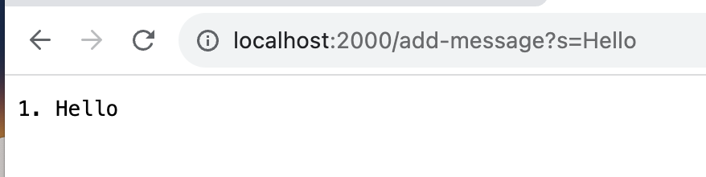
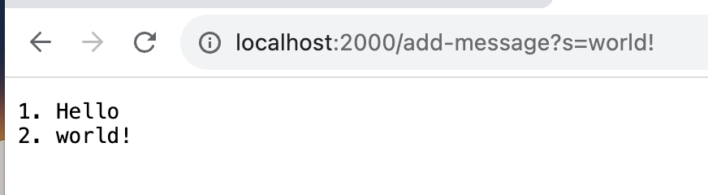
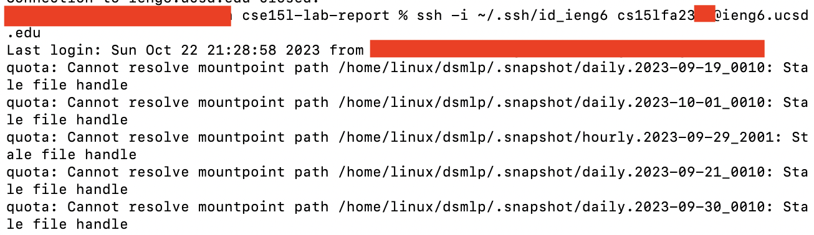
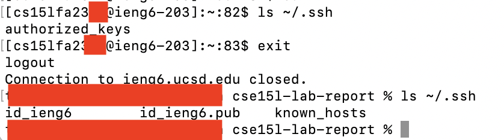

# Lab Report 2

## Part 1

Here is the code for StringServer, compiled with `javac StringServer.java` and run with `java StringServer <port number>`:

```
import java.io.IOException;
import java.net.URI;

class Handler implements URLHandler {
    // The one bit of state on the server: a number that will be manipulated by
    // various requests.
    String accumulator = "";
    int index = 0;

	void addMessage(String msg) {
		index += 1;
		accumulator += Integer.toString(index) + ". " + msg + "\n";
	}

    public String handleRequest(URI url) {
        if (url.getPath().equals("/add-message")) {
			String[] parameters = url.getQuery().split("=");

			if (parameters[0].equals("s") && parameters.length > 1) {
				addMessage(parameters[1]);
			}
		}

		return accumulator;
    }
}

class StringServer {
    public static void main(String[] args) throws IOException {
        if(args.length == 0){
            System.out.println("Missing port number! Try any number between 1024 to 49151");
            return;
        }

        int port = Integer.parseInt(args[0]);

        Server.start(port, new Handler());
    }
}
```

The code depends on the other classes given in lab.

Here is the first screenshot, when accessing `/add-message?s=Hello`:



Here is the second screenshot, when accessing `/add-message?s=world!`:



In the first screenshot, the request is first passed into `ServerHttpHandler::handle`. The URI, which contains `/add-message?s=Hello`, is passed into `Handler::handleRequest` at `Server.java:26`, at which point my code runs. The path is checked and indeed equals `/add-message`. The query string is split and the first part is checked to equal `s`. This check also succeeds, so `Handler::addMessage` is called with `"Hello"`. In this function, index is incremented from 0 to 1, and then the string `1. Hello\n` is added to the accumulator string. Finally, control passes back to `Handler::handleRequest` which returns the accumulator, and this is eventually passed as an HTTP response in `Server.java`.

In the second screenshot, nearly everything is the same, except the URI is now `/add-message?s=world!`, and `Handler::addMessage` is called with `"world!"`. Index is incremented from 1 to 2 and `"2. world!\n"` is added to the accumulator string, so that the accumulator now reads `1. Hello\n2. world!\n`.

## Part 2

The path to the private key on my computer is `~/.ssh/id_ieng6`, where `~` is my home directory. The path to the public key on the server is at `~/.ssh/authorized_keys`.

Here is a screenshot of me logging in with my generated SSH key, stored in `~/.ssh/id_ieng6`:



And here is a screenshot of the locations of the keys.


