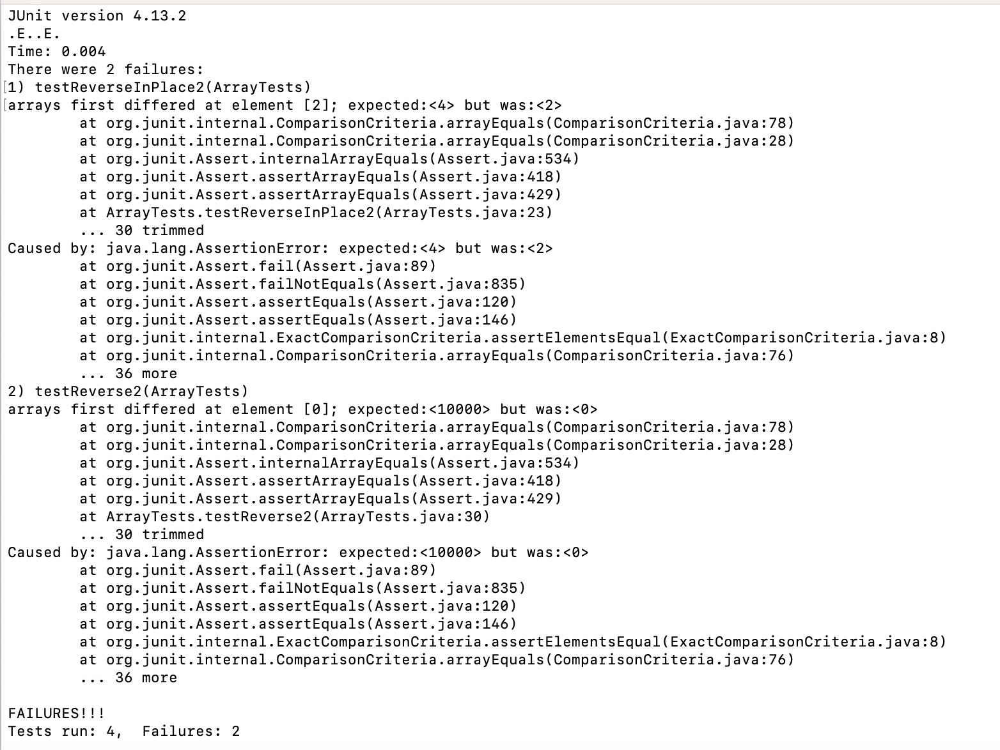
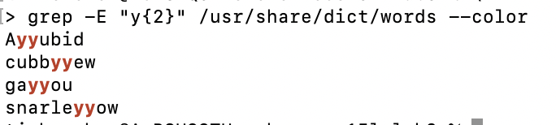

# Lab report 3 – Bugs and Commands

## Part 1

The following test fails:

```
  @Test
  public void testReverse2() {
	  int[] input = { 1, 10, 100, 1000, 10000 };
	  int[] result = ArrayExamples.reversed(input);
	  assertArrayEquals(new int[] { 10000, 1000, 100, 10, 1 }, result);
  }
```

The following test succeeds:

```
  @Test
  public void testReversed() {
    int[] input1 = { };
    assertArrayEquals(new int[]{ }, ArrayExamples.reversed(input1));
  }
```

Here is the example of running JUnit (there are two other tests, one that succeds and one that does not):




The issue in the `reversed` function is that we are assigning to arr from newArray, and not the other way around. Consequently, the original array is being mutated rather than the new array. Sadly, the Java programming language has no such thing as const-correctness and could not warn us of this grave error. Here is the change I made:

```diff
@@ -14,9 +16,9 @@ public class ArrayExamples {
   static int[] reversed(int[] arr) {
     int[] newArray = new int[arr.length];
     for(int i = 0; i < arr.length; i += 1) {
-      arr[i] = newArray[arr.length - i - 1];
+      newArray[i] = arr[arr.length - i - 1];
     }
-    return arr;
+    return newArray;
   }
```

There is also an issue in the reverseInPlace function, which is that it starts to read already-reversed values and produces a symmetric output consisting of the last half of the original output. This can be trivially fixed with two pointers, swapping between them, and terminating as soon as we'd start overwriting already-swapped values.


```diff
@@ -4,8 +4,10 @@ public class ArrayExamples {
 
   // Changes the input array to be in reversed order
   static void reverseInPlace(int[] arr) {
-    for(int i = 0; i < arr.length; i += 1) {
-      arr[i] = arr[arr.length - i - 1];
+    for(int i = 0, j = arr.length - 1; i < j; i += 1, j -= 1) {
+      int t = arr[i];
+      arr[i] = arr[j];
+      arr[j] = t;
     }
   }
```

After these changes, all the tests pass.

```
JUnit version 4.13.2
....
Time: 0.004

OK (4 tests)
```

## Part 2

I choose `grep`.

One particularly useful feature is the A, B, and C flags, which take in a numeric value and output lines below, above, and surrounding a match, respectively. The number of adjacent lines displayed is given by the passed numeric value.

Here's an example (using `/usr/share/dict/words` as a test file):

No additional options (one match):

```
$ grep "zygy" /usr/share/dict/words
syzygy
```

Matching 10 lines below:

```
$ grep "zygy" /usr/share/dict/words -A 10
syzygy
szaibelyite
Szekler
szlachta
szopelka
T
t
ta
taa
Taal
Taalbond
```

Matching only 2 additional lines below:

```
$ grep "zygy" /usr/share/dict/words -A 2 
syzygy
szaibelyite
Szekler
```

Matching 2 additional lines above:

```
$ grep "zygy" /usr/share/dict/words -B 2
syzygial
syzygium
syzygy
```

Matching 2 additional lines above and below:

```
$ grep "zygy" /usr/share/dict/words -C 2
syzygial
syzygium
syzygy
szaibelyite
Szekler
```

Actually, the `-C` flag is equivalent to having both an `-A` and `-B` flag, with the same value.

The second most interesting thing is regex capabilities. Suppose we want to know what words contain "m", "z", and "q" in that order, possibly with characters in between. This is trivial with regex:

```
$ grep "m.*z.*q" /usr/share/dict/words
mozambique
````

We can even do more complicated stuff, although on some platforms we need to turn on the extended regex option with `-E`:

```
$ grep "y{2}" /usr/share/dict/words 
(no output)
```

```
$ grep -E "y{2}" /usr/share/dict/words
Ayyubid
cubbyyew
gayyou
snarleyyow
````

Another useful property of grep is color highlighting, which is enabled via the `--color` option. I find this useful when grepping in files with very long lines.



Finally, a useful grep option is `-m`, which stops printing after a maximum number of matches.

```
$ grep -E "m{2}" /usr/share/dict/words -m 10
accommodable
accommodableness
accommodate
accommodately
accommodateness
accommodating
accommodatingly
accommodation
accommodational
accommodative
```

In this case, there are

```
$ grep -E "m{2}" /usr/share/dict/words --count
2021
```

matches in the whole file, and so if we only want a few we can terminate things early.
